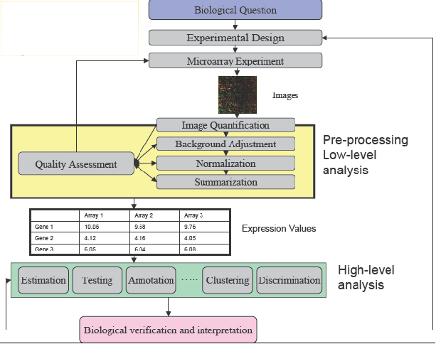
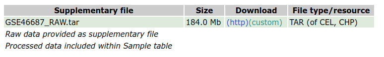

```{r class.source = 'fold-hide', setup, include=FALSE}
library(knitr)
library(rmdformats)

## Global options
options(max.print="75")
opts_chunk$set(echo=FALSE,
	             cache=TRUE,
               prompt=FALSE,
               tidy=TRUE,
               comment=NA,
               message=FALSE,
               warning=FALSE)
opts_knit$set(width=75)
```


# Introducción

Este documento presenta un análisis de datos de microarrays de principio a fin que es una propuesta de resolución de una PEC ("Prueba de Evaluación Continua") propuesta en la asignatura de "Análisis de Datos Ómicos" en la UOC.

Es importante insistir en la idea de "una propuesta". Es decir, muchos de los pasos del proceso de análisis de datos ómicos pueden hacerse de diversas formas, usando distintas aproximaciones o distintos paquetes. Incluso algunos pasos, como el filtraje o la exploración antes y después de normalizar, pueden omitirse sin que el resultado deba considerarse incorrecto. Es por ello que debemos insistir en que el objetivo del análisis es mostrar una forma razonablemente correcta de resolver el problema, siguiendo las indicaciones proporcionadas, y de acuerdo con los conceptos y métodos presentados en la asignatura.


## Estructura del documento

Habitualmente, un trabajo científico o técnico se organiza en varias partes: _Introducción_, _Material y Métodos_, _Resultados_ y _Discusión_. Dado que el objetivo de este estudio es demostrar la aplicación de los métodos de análisis explicados en la asignatura esta estructura se relajará. Después de la introducción se realizará una breve descripción del proceso general y los métodos utilizados en cada paso. A continuación se presentarán los resultados obtenidos en cada fase del análisis. Finalmente se presentará una breve discusión sobre las posibles limitaciones encontradas.

Con el fin de facilitar la legibilidad del documento, se ha ocultado el código, con la opción global de Rmarkdown, `echo=FALSE`, para que, salvo contadas ocasiones, no se muestre en el texto. Aquellos fragmentos que se han querido mostrar se han modificado fragmento a fragmento con la opción  `echo=TRUE`.
El código del análisis se ha extraíso del documento con la función `purl` del paquete `knitr` y se ha copiado en un pedazo de código final cuya ejecución se ha anulado, mediante la opción `eval=FALSE`.

## Contexto y Objetivos

El síndrome de Turner (TS) es el trastorno de aneuploidía (pérdida de un cromosoma) del cromosoma X más común en las mujeres, y el cariotipo predominante es 45X, una pérdida completa del segundo cromosoma sexual. Dependiendo del origen parental del cromosoma X único, los pacientes con 45X se pueden dividir en dos grupos: 45Xm y 45Xp con cromosoma X heredado de la madre o el padre, respectivamente. Se ha comprobado que los pacientes con TS de 45Xm y 45Xp se asocian con diferentes grados de gravedad en el fenotipo, incluida la prevalencia de enfermedad cardiovascular.

El objetivo de este este trabajo es realizar un análisis de datos de microarrays para encontrar genes diferencialmente expresados entre los dos subtipos de TS, 45xm y 45xp así como entre estos y un fenotipo normal, 46XX.

El análisis se basará en los datos de un estudio depositado en Gene Expresion Omnibus (GEO) con identificador "GSE46687" derivado de un estudio sobre identificación de genes que intervienen en la patogénesis del síndrome de Turner (Ver @Wang2020).

Estos datos contienen muestras de los dos subtipos del síndrome, 45Xm y 45Xp así como del fenotipo normal 46XX y por loo tanto, el objetivo específico será llevar a cabo las tres comparaciones "naturales" en este problema:

1. 45xm vs 45Xp
2. 46XX vs 45Xm y
3. 46XX vs 45Xp

# Materiales y métodos
## Etapas del analisis

El análisis se ha realizado siguiendo las pautas descritas en los materiales de la asignatura [https://aspteaching.github.io/Analisis_de_datos_omicos-Materiales_para_un_curso/](https://aspteaching.github.io/Analisis_de_datos_omicos-Materiales_para_un_curso/) y resumidos en la figura 1.



## Métodos de análisis

 _Esta primera parte es ficticia en tanto que no hemos tenido acceso al proceso de elaboración de los microarrays, por lo que he escrito lo que suele ponerse en esta parte_

Antes de hibridar los microarrays se comprobó la calidad del cRNA de cada muestra. Sólo las que demostraron una calidad suficiente --presumiblemente un valor de ``Bio-analyser'' igual o superior a 7-- se sometieron a análisis posterior. 

Los valores ``crudos'' de expresión obtenidos directamente de los
archivos CEL se pre-procesaron utilizando el método de RMA
[@rmaIri], un proceso de tres pasos que integra la corrección
de fondo, la normalización y el resumen de los valores del grupo de
sondas en un único valor de expresión _absoluta_. Dichos valores
normalizados fueron la base para todos los análisis.

Antes de la selección de genes los valores normalizados se sometieron
a un filtraje no específico para eliminar los genes de baja señal
(los genes cuya media de la señal en cada grupo no supera un umbral
mínimo) y los genes de baja variabilidad (los genes cuyo rango
intercuartil entre todas las muestras no superó un umbral mínimo).

La selección de genes diferencialmente expresados entre condiciones
experimentales se baso en la utilización de modelos lineales
complementados con una moderación de la varianza mediante métodos
bayesianos empíricos siguiendo la metodología desarrollada por Smyth
[@Smyth2004].  Este método extiende el análisis de la varianza clásico
utilizando métodos Bayesianos empíricos para combinar la información
de cada gen individual con la de todos los genes restantes para
obtener mejores estimaciones de error. Esto es de gran utilidad en
análisis de microarrays, un contexto en el que el tamaño de las
muestras es a menudo pequeño lo que puede dar lugar a estimaciones de
los errores erráticos y, en consecuencia, p-valores que no son de
fiar.

Los genes más relevantes de cada comparación se resaltaron utilizando
_volcano-plots_, que organizan los genes a lo largo de dos
dimensiones que podemos considerar de importancia biológica y
estadística. El eje horizontal representa el cambio medio de expresión
entre los dos grupos (en una escala logarítmica, por lo que la
regulación hacia arriba y abajo aparecen simétrica), y el segundo
(vertical) representa el _menos logaritmo del p-valor_ por lo que
los genes cuyo p-valor asociado sea inferior aparecen más arriba. El
primer eje indica el impacto biológico del cambio, y el segundo indica
la evidencia estadística, o la fiabilidad de dicho cambio.

Con el fin de hacer frente a la problemática derivada del hecho de que
muchas pruebas (una por cada gen) se realizan simultáneamente, se
realizo un ajuste de p--valores para obtener control sobre la tasa de
falsos positivos usando el método de Benjamini y Hochberg
[@Benjamini1995].

Los genes seleccionados como diferencialmente expresados se agruparon
para buscar patrones comunes de expresión entre condiciones
experimentales.  Para ello se utilizaron mapas de colores o
_Heatmaps_ que realizan una agrupación jerárquica de los genes y/o
las muestras y la representan mediante una gama de colores apropiada,
de forma que valores altos o bajos se corresponden a colores distintos
de la gama escogida.

Las listas de genes diferencialmente expresados se anotaron en
diversas bases de datos (Entrez, Unigene, Gene Ontology, KEGG, ...)
utilizando los paquetes de anotación para microarrays de affymetrix
disponibles en el proyecto Bioconductor
[http://bioconductor.org](http://bioconductor.org).

Para contribuir a la interpretación biológica de los resultados se
realizó un análisis de enriquecimiento [@Falcon:2007] que busca
establecer si las categorías funcionales de los genes seleccionados
aparecen entre estos genes con mayor (o menor) frecuencia que entre
todos los del genoma. De ser así se indica que la lista de genes se
encuentra "enriquecida" en estas funcionalidades, o lo que es lo
mismo que los procesos afectados por las diferencias son éstos.

### Herramientas y procedimientos  bioinformáticos de análisis

Los análisis estadísticos se realizaron utilizando el lenguaje
estadístico R y las librerías desarrolladas para el análisis de
microarray en el proyecto de Bioconductor.

El código siguiente se utilizó para instalar los paquetes de Bioconductor necesarios para el análisis.

```{r, librerias, echo=TRUE}
installifnot <- function (pckgName){
if(!(require(pckgName, character.only=TRUE))){
  BiocManager::install(pckgName)
  }
}
installifnot("Biobase")
installifnot("hgu133plus2.db")
installifnot("affy")
installifnot("arrayQualityMetrics")
installifnot("genefilter")
installifnot("limma")
installifnot("annotate")
installifnot("hwriter")
installifnot("gplots")
installifnot("GOstats")
```

# Obtención y lectura de los datos
## Los datos para el análisis

Este estudio tiene 46 muestras en tres grupos por lo que trabajaremos con un subconjunto de las mismas.

Los datos crudos pueden descargarse de GEO directamente accediendo a la dirección: <https://www.ncbi.nlm.nih.gov/geo/query/acc.cgi?acc=GSE46687> donde encontramos el enlace para la descarga, al final de la página:



Descargamos los archivos comprimidos a un directorio "datos" que crearemos como subdirectorio de nuestro proyecto. Allí descomprimiremos dichos archivos hasta tener los archivos .CEL

## La "plataforma" o tipo de microarray

Para trabajar con microarrays, necesitamos conocer de que tipo son, puesto que ello nos permite saber qué paquete de anotaciones necesitamos Esta información se encuentra también en la página de GEO correspondiente a los datos:


Esto nos indica que se trata de arrays de tipo 3'ITV en concreto el modelo HGU 133 plus 2 de Affymetrix, cuyas anotaciones se encuentran en el paquete `hgu133plus.db` de Bioconductor.


## Selección de muestras y carga de los datos

La lectura de datos se lleva a cabo utilizando las clases y métodos definidas en los paquetes `Biobase` y `oligo` de Bioconductor. Una forma cómoda de leer los datos y, al mismo tiempo, asignar a cada muestra los valores de las covariables (por ejemplo el grupo para el análisis) consiste en crear un pequeño archivo de texto, que suele denominarse `targets.csv` y que contiene la identificación de cada archivo con la asignación de cada muestra a cada condición experimental. En nuestro caso disponemos del archivo `targetsAll.csv` al que añadiremos los nombres de los archivos.

```{r class.source = 'fold-hide'}
listaArchivos <- list.files("datos")
nombres<-substr(listaArchivos,1,10)
targets0<- read.csv("targetsAll.csv", row.names =1 )
if (sum(nombres==rownames(targets0)))
  targets<- cbind(filenames=listaArchivos,targets0)
```

El contenido del archivo `targets` se utiliza en la lectura de los datos y la creación del objeto `rawData` las intensidades "crudas" de cada archivo .CEL. 

### Creación de un subconjunto para el análisis

Con el fin de que nuestro análisis contenga un número moderado de muestras podemos extraer aleatoriamente 6 muestras de cada grupo. Para ello utilizaremos la función `selectSample`para crear un nuevo objeto "targets" que tenga únicamente las filas seleccionadas.

```{r class.source = 'fold-hide', echo=TRUE}
selectSamples<- function (myID){
  set.seed(myID)
  selected <- c(sample(1:10, 6),11, sample(12:26, 5), sample(27:36,6))
  return(sort(selected))
}
```

Escogiendo como argumento el número "1234567" se obtiene:

```{r}
mySelected <- selectSamples(1234567)
selectedTargets <- targets[mySelected,]
table(selectedTargets$karyotype)
```

## Lectura de los datos

En primer lugar crearemos un objeto de tipo `annotatedDataFrame` que utilizaremos para leer los datos crudos.

```{r, phenoData1}
require(Biobase)
sampleInfo <-AnnotatedDataFrame(selectedTargets) 
show(pData(sampleInfo))
```

Dado que se trata de arrays algo antiguos, del tipo de los que aparecen en los materiales docentes podemos utilizar el paquete `affy` para leer los datos.

```{r}
library(affy)
fileNames <- paste0("datos/",pData(sampleInfo)$filenames)
rawData <- read.affybatch(filenames=fileNames,phenoData=sampleInfo)
show(rawData)
```

Este objeto es la base para todos los análisis que se realizarán.

# Preprocesado: Exploración, Control de Calidad y Normalización

## Exploración y visualización

La exploración de los datos suele basarse en técnicas univariantes como los histogramas o los diagramas de caja o en técnicas multivariantes como los análisis de conglomerados (clusters), de distancias o de análisis de componentes principales.

```{r, etiquetas}
## ----preajustes
colores <- c(rep("yellow", 6), rep("blue", 6), rep("red", 6))
formas <-  c(rep(11, 6), rep(12, 6), rep(13, 6))
grupos <- as.factor(pData(rawData)$karyotype)
numSamples <- nrow(pData(rawData))
sampleNames <-pData(rawData)$title
colnames(exprs(rawData))<-sampleNames
```


```{r, explora1}
## ----plotHist
hist(rawData, main="Signal distribution", col=colores, lty=1:numSamples)
legend (x="topright", legend=sampleNames , col=colores, lty=1:numSamples, cex=0.6)

## ----boxplot
boxplot(rawData, cex.axis=0.6, col=colores, las=2, names=sampleNames, 
        main="Signal distribution for selected chips")
```

El histograma y el diagrama de caja muestran que las distribuciones de los datos son similares en formas pero no en posición, lo que ya sugiere que será preciso algún tipo de centrado.

```{r, plotPCA}
## ----plotPCA
library(ggplot2)
library(ggrepel)
plotPCA3 <- function (datos, labels, factor, title, scale,colores, size = 1.5, glineas = 0.25) {
  data <- prcomp(t(datos),scale=scale)
  # plot adjustments
  dataDf <- data.frame(data$x)
  Group <- factor
  loads <- round(data$sdev^2/sum(data$sdev^2)*100,1)
  # main plot
  p1 <- ggplot(dataDf,aes(x=PC1, y=PC2)) +
    theme_classic() +
    geom_hline(yintercept = 0, color = "gray70") +
    geom_vline(xintercept = 0, color = "gray70") +
    geom_point(aes(color = Group), alpha = 0.55, size = 3) +
    coord_cartesian(xlim = c(min(data$x[,1])-5,max(data$x[,1])+5)) +
    scale_fill_discrete(name = "Group")
  # avoiding labels superposition
  p1 + geom_text_repel(aes(y = PC2 + 0.25, label = labels),segment.size = 0.25, size = size) + 
    labs(x = c(paste("PC1",loads[1],"%")),y=c(paste("PC2",loads[2],"%"))) +  
    ggtitle(paste("Principal Component Analysis for: ",title,sep=" "))+ 
    theme(plot.title = element_text(hjust = 0.5)) +
    scale_color_manual(values=colores)
  }
```


```{r, explora2}
plotPCA3(exprs(rawData), labels=sampleNames, size=2, factor =grupos, 
         colores = c("red", "blue", "green"), title="selected samples", scale=TRUE)
```

La representación de los datos en las dos primeras componentes principales muestra que no hay una separación clara entre los grupos lo que nos lleva a pensar que puede algún tipo de _efecto batch_ que explique la diferencia. 

Un cluster jerárquico refuerza esta impresión:

```{r, explora3}
clust.euclid.average <- hclust(dist(t(exprs(rawData))),method="average")
plot(clust.euclid.average, labels=sampleNames, main="Hierarchical clustering of samples",  hang=-1)
```

La muestra `Xp_rep6` se separa de todas las demás. Una posibilidad es eliminarla del análisis.

El paquete `arrayQualitMetrics` encapsula todos los análisis anteriores, y
alguno más, facilitando su ejecución e incluso su interpretación. La instrucción
`arrayQualityMetrics` lleva a cabo todos los análisis de una vez y genera un informe de resultados con ayudas a la interpretación y a la detección de arrays problemáticos.

```{r, arrayQM, cache=TRUE, eval=FALSE}
library(arrayQualityMetrics)
arrayQualityMetrics(rawData, outdir = "arrayQuality",intgroup= "karyotype", force=TRUE)
```

Los resultados del control de calidad realizado con `arrayQualityMetrics` se encuentran accesibles a través del archivo index.html contenido en el subdirectorio creado al invocarlo -en este caso denominado `arrayQuality`.


## Análisis de efectos batch (1)

Los análisis de componentes principales sugieren que puede haber algún factor que se superponga a las diferencias entre los grupos. Dado que no se dispone de información sobre otras covariables es difícil decidir si ésto es así.
Una causa habitual del efectos batch es la fecha en que se procesan las muestras. 

Una búsqueda en Google muestra que es posible obtener la fecha de hibridación de los archivos .CEL mediante la función `get.celfile.dates` del paquete `affyio`.

```{r}
library(affyio)
HybDates<- as.factor(get.celfile.dates(fileNames))
show(HybDates)
pData(rawData) <- cbind(pData(rawData), HybDates)
with(pData(rawData), table(HybDates, karyotype))
```

La tabla muestra que la hibridación se ha hecho de la peor manera posible confundiendo fecha y cariotipo para el grupo 46XX. Esto significa que, __si se encuentran diferencias entre este grupo y los demás no podremos estar seguros de si atribuirlo a la diferencia en expresión o a un efecto técnico__. Es lamentable pero absolutamente habitual en estudios con expresión génica.

```{r class.source = 'fold-hide', explora2Bis}
plotPCA3(exprs(rawData), labels=sampleNames, size=2, factor=HybDates, colores = c("red", "blue", "green", "grey", "black"), title="selected samples", scale=TRUE)
```


```{r, explora4}
plot(clust.euclid.average, labels=HybDates, main="Hierarchical clustering of samples",  hang=-1)
```

Dado que no todos los  estan presentes en todos los lotes no es posible eliminar el efecto batch completamente. 
Una forma de hacerlo, al menos en parte, es incluir la fecha como factor en el modelo de análisis. 

## Normalizacion y Filtraje

Una vez realizado el control de calidad se procede a normalizar los datos y
agregarlos. 


```{r class.source = 'fold-hide', normalizacion}
library(affy)
eset_rma <- rma(rawData)    
eset_rma
```

## Filtraje

El filtraje no específico permite eliminar los genes que varían poco entre
condiciones o que deseamos quitar por otras razones como por ejemplo que no
disponemos de anotación para ellos. La función `nsFilter` permite eliminar los
genes que, o bien varían poco, o bien no se dispone de anotación para ellos.
Si al filtrar deseamos usar las anotaciones, o la falta de ellas, como criterio
de filtraje debemos disponer del correspondiente paquete de anotaciones.

Si al crear el objeto `expressionSet` no se le ha asignado una anotación debe hacerse antes de filtrar pera evitar un error, que se producirá en el caso que intentemos filtrar con el parámetro `require.entrez`puesto en TRUE. 

En este caso no hay problema porque el procedimiento de lectura identifica el tipo de array y rellena automáticamente el campo `annotation`. Podemos visualizarlo con la instrucción `annotation`.

```{r, echo=TRUE}
show(annotation(eset_rma))
```

Aplicaremos un filtraje "estándar" que retenga el 50% de los genes con mayor variabilidad de entre aquellos que estan correctamente anotados, es decir eliminando aquellos que no tienen identificador en la base de datos `Entrez`.
```{r class.source = 'fold-hide', filtraje}
library(genefilter)
filtered <- nsFilter(eset_rma, require.entrez=TRUE,
         remove.dupEntrez=TRUE, var.func=IQR,
         var.cutoff=0.5, var.filter=TRUE,
         filterByQuantile=TRUE, feature.exclude="^AFFX")
```

El resultado del filtraje es una lista con varios objetos, que informan de lo que se ha descartado y un objeto `expressionSet` que, en lugar de 54675 "features" tiene 10087 que son los que estan anotados y tienen mayor variabilidad. La selección de genes se llevará a cabo sobre esta lista.

```{r, echo=TRUE}
names(filtered)
class(filtered$eset)
print(filtered$filter.log)
eset_filtered <-filtered$eset
```


### Archivos de resultados normalizados

Los dos objetos `expressionSet` resultantes de la normalización y el filtraje se almacenan en un archivo binario `datos.normalizados.Rda`, que será la base para todos los estudios posteriores.

```{r class.source = 'fold-hide', saveData}
save(eset_rma, eset_filtered, file=paste0("results/","datos.normalizados.Rda"))
```

# Selección de genes diferencialmente expresados

Como en las etapas anteriores la selección de genes diferencialmente expresados (GDE) puede basarse en distintas aproximaciones, desde la t de Student al programa SAM pasando por multitud de variantes.
En este ejemplo, dado que se realizaran tres comparaciones que luego deseamos comparar entre ellas, se aplicará la aproximación presentada por @Smyth2004 basado en la utilización del modelo lineal general combinada con
un método para obtener una estimación mejorada de la varianza.

## Matrices de diseño y de contrastes

El primer paso para el análisis basado en modelos lineales es crear la matriz
de diseño. 

Básicamente, la matriz de diseño es una tabla que describe la asignación de cada muestra a un grupo. 
Tiene tantas filas como muestras y tantas columnas como grupos (si solo se considera un factor).
Cada fila contiene un uno en la columna del grupo al que pertenece la muestra y un cero en las restantes.

La matriz de contrastes se utiliza para describir las comparaciones entre
grupos. Consta de tantas columnas como comparaciones y tantas filas como
grupos (es decir como columnas de la matriz de diseño). 
Una comparación entre grupos –llamada "contraste"– se representa con un "1" y un "-1" en las filas de los grupos a comparar y ceros en las restantes. Si varios grupos intervinieran en la comparación se tendría tantos coeficientes como grupos con la única restricción de que su suma sería cero. 

La matriz de diseño puede definirse manualmente o a partir de un factor
creado específicamente para ello.
Manualmente, seria:

```{r class.source = 'fold-hide', matDesign1, echo=TRUE}
design1<-matrix(
            c(1,1,1,1,1,1, 0,0,0,0,0,0, 0,0,0,0,0,0,
              0,0,0,0,0,0, 1,1,1,1,1,1, 0,0,0,0,0,0,
              0,0,0,0,0,0, 0,0,0,0,0,0, 1,1,1,1,1,1),
            nrow=18,byrow=F)
colnames(design1)<-c("XX", "Xm", "Xp")
rownames(design1) <-  sampleNames 
print(design1)
```

La instrucción `model. matrix` permite generar la matriz de diseño a partir de uno o más factores:

```{r class.source = 'fold-hide', matDesign1b}
design1b <- model.matrix(~ 0+grupos)
colnames(design1b)<-c("Xm", "Xp", "XX")
rownames(design1b) <-  sampleNames 
print(design1b)
```


Las comparaciones que nos interesan son las diferencias, dos a dos entre cada cariotipo lo que puede hacerse con los contrastes siguientes:

```{r class.source = 'fold-hide', contrastes, echo=TRUE}
library(limma)
cont.matrix <- makeContrasts (
      XvsM = Xm-XX,
      XvsP = Xp-XX,
      MvsP = Xp-Xm,
      levels=design1)
print(cont.matrix)
```


## Estimación del modelo y selección de genes

Una vez definida la matriz de diseño y los contrastes podemos pasar a estimar el modelo, estimar los contrastes y realizar las pruebas de significación que nos indiquen, para cada gen y cada comparación, si puede considerarse diferencialmente expresado.

El método implementado en limma amplía el análisis tradicional utilizando modelos de Bayes empíricos para combinar la información de toda la matriz de datos y de cada gen individual y obtener estimaciones de error mejoradas. 

El análisis proporciona los estadísticos de test habituales como Fold-change t-moderados o p-valores ajustados que se utilizan para ordenar los genes de más a menos diferencialmente expresados.

A fin de controlar el porcentaje de falsos positivos que puedan resultar del alto numero de contrastes realizados simultáneamente los p–valores se ajustan de forma que tengamos control sobre la tasa de falsos positivos utilizando el
método de Benjamini y Hochberg.

```{r class.source = 'fold-hide', linearmodelfit}
library(limma)
fit<-lmFit(eset_filtered, design1)
fit.main<-contrasts.fit(fit, cont.matrix)
fit.main<-eBayes(fit.main)
```

La función `topTable` genera para cada contraste una lista de genes ordenados
de mas a menos diferencialmente expresados.

```{r class.source = 'fold-hide', topTabs1}
topTab_XvsM <- topTable (fit.main, number=nrow(fit.main), coef="XvsM", adjust="fdr"); head(topTab_XvsM)
topTab_XvsP <- topTable (fit.main, number=nrow(fit.main), coef="XvsP", adjust="fdr"); head(topTab_XvsP)
topTab_MvsP  <- topTable (fit.main, number=nrow(fit.main) , coef="MvsP", adjust="fdr"); head(topTab_MvsP)
```

Un volcano-plot es una figuras que permite visualizar si hay muchos o pocos genes con un gran fold-change y significativamente expresados o si este número
es bajo. Estos gráficos representa en abscisas los cambios de expresión en escala logarítmica y en ordenadas el "menos logaritmo" del p-valor o alternativamente
el estadístico B ("log-odds").

```{r class.source = 'fold-hide', volcano}
library(annotate)
probeNames <-rownames(fit.main)
Symbols <- getSYMBOL(probeNames, annotation(eset_rma))
myNames <- paste(probeNames, Symbols, sep=".")
head(myNames)
volcanoplot(fit.main, coef="XvsM", highlight=10, names=Symbols)
```


## Comparaciones múltiples

Cuando se realizan varias comparaciones a la vez puede resultar importante ver que genes cambian simultáneamente en más de una comparación.

Si el número de comparaciones es alto también puede ser necesario realizar un ajuste de p-valores entre las comparaciones, distinto del realizado entre genes.

La función `decidetests` permite realizar ambas cosas.
En este ejemplo no se ajustaran los p-valores entre comparaciones. Tan solo se seleccionaran los genes que cambian en una o más condiciones.

EL resultado del análisis es una tabla `res` que para cada gen y cada comparación  contiene un 1 (si el gen esta sobre-expresado o ``up'' en esta condicion), un 0 (si no hay cambio significativo) o un -1  (si esta ``down''-regulado).

```{r class.source = 'fold-hide', decideTests}
res<-decideTests(fit.main, method="separate", adjust.method="fdr", p.value=0.05, lfc=0)
```

Para resumir dicho análisis podemos contar qué filas tienen como mínimo una celda distinta de cero:

```{r class.source = 'fold-hide', resumeDecideTests, eval=TRUE}
sum.res.rows<-apply(abs(res),1,sum)
res.selected<-res[sum.res.rows!=0,] 
print(summary(res))
```

Un diagrama de Venn permite visualizar la tabla anterior sin diferenciar entre genes ``up'' o ``down'' regulados.

```{r class.source = 'fold-hide',   fig.cap="Número de genes seleccionado en cada comparacion"}
vennDiagram (res.selected[,1:3], main="Genes in common #1", cex=0.9)
```

## Resultados

El resultado es bastante claro y coincide con lo que habíamos visto en el análisis exploratorio:

- La diferencia más clara está entre los grupos XX y Xm
- XX y XP estan poco separados
- No se detectan diferencias entre XM y XP

Este resultado, sin embargo, tiene que quedar, en el mejor de los casos en entredicho puesto que, como se ha visto, las diferencias entre estos grupos coinciden con las que podríamos atribuir a los efectos batch.

Una alternativa que llevaríamos a cabo en una situación real sería repetir los análisis dentro de alguno de los lotes, por ejemplo las muestras hibridadas en 2008 y ver si coinciden con los anteriores, De ser así se confirmarían estos resultados pero la duda quedaría pendiente sobre las comparaciones en las que ésto no es posible.

## Visualización de los perfiles de expresión

Tras seleccionar los genes diferencialmente expresados podemos visualizar 
las expresiones de cada gen agrupándolas para destacar los genes que se 
encuentran up o down regulados simultáneamente constituyendo _perfiles de expresión_.

Hay distintas formas de visualización pero aquí tan sólo se presenta el uso de mapas de color o "Heatmaps".

En primer lugar seleccionamos los genes a visualizar: Se toman todos aquellos que 
han resultado diferencialmente expresados en alguna de las tres comparaciones.

```{r class.source = 'fold-hide', prepareData}
probeNames<-rownames(res)
probeNames.selected<-probeNames[sum.res.rows!=0]
exprs2cluster <-exprs(eset_filtered)[probeNames.selected,]
colnames(exprs2cluster)<-sampleNames
color.map <- function(grupo) { 
  if (grupo=="46XX"){
    c<- "yellow" 
  }else{ 
    if (grupo=="45Xm"){
      c<- "red"
    }else{
      c<- "blue"
   }
  }
return(c)}
```

Para representar el Heatmap tan sólo necesitamos la matriz de datos resultante.

```{r class.source = 'fold-hide', plotHeatMap1, fig.cap="Mapa de colores basado en los genes seleccionados por estar diferencialmente expresados. Como puede verse los tumores Apocrinos y Luminales tienen perfiles de expresión más parecidos entre ellos que cada uno con los de tipo Basal"}
grupColors <- unlist(lapply(pData(eset_filtered)$karyotype, color.map))
heatmap(exprs2cluster, col=rainbow(100), ColSideColors=grupColors, cexCol=0.9)
```

El gráfico muestra claramente que hay grupos de genes que varían entre los grupos XX y los otros dos que se diferencian mucho menos.

# Análisis de significación biológica

Una vez obtenidas las listas de genes diferencialmente expresados pueden llevarse a cabo todo tipo de análisis sobre ellas, generalmente encaminados a facilitar la interpretación de los resultados.

Entre estas exploraciones –que podemos llamar genéricamente"post-procesado de las listas" se encuentra la anotación de las listas de genes en diversas bases de datos.

EL análisis de significación biológica de las listas mediante análisis de enriquecimiento o mediante "gene set analysis" para detectar si las listas se encuentran enriquecidas en genes asociados a funciones o procesos biológicos determinados.

En vista de que las comparaciones entre los grupos XX-Xp y XM-Xp dan pocos o ningún gen seleccionados y, además, pueden estar influidos por el efecto batch tan sólo se realizará el análisis de significación para la primera comparación.

Puesto que el número de genes que podemos considerar diferencialmente expresados es suficientemente alto se realizará un análisis de sobre-representación o _Gene Enrichment Analysis_.

Se han desarrollad multitud de variantes de estos tipos de análisis (@Khatri:2005) pero aquí utilizaremos el análisis básico de enriquecimiento tal como se describe en los trabajos de Falcon y Gentleman (Falcon:2007) implementados en el paquete `GOstats` de Bioconductor.

El análisis se realiza sobre dos bases de datos de anotaciones, la "Gene Ontology'' o la ``Kyoto Encyclopedia of Genes and Genomes''.

Los análisis de este tipo necesitan un número mínimo de genes para resultar fiables por lo que se incluirán en todos los genes con p--valores ajustados inferiores a 0.05 (sin filtrar por mínimo ``fold--change'').

```{r class.source = 'fold-hide', ORA, eval=TRUE}
library(GOstats)
# Seleccionamos la "topTable"
topTab <- topTab_XvsM
# Definimos el universo de genes: todos los que se han incluido en el análisis
# EL programa trabaja con identificadores "entrez" y no admite duplicados
entrezUniverse = unique(getEG(rownames(topTab), "hgu133plus2.db"))
  
# Escogemos los grupos de sondas a incluir en el análisis
# Este análisis trabaja bien con varios centenares de genes 
# por lo que es habitual basarse en p-valores sin ajustar para incluirlos

whichGenes<-topTab["adj.P.Val"]<0.05
geneIds <-   unique(getEG(rownames(topTab)[whichGenes],"hgu133plus2.db"))
  
# Creamos los "hiperparámetros" en que se basa el análisis
GOparams = new("GOHyperGParams",
    geneIds=geneIds, universeGeneIds=entrezUniverse,
    annotation="org.Hs.eg.db", ontology="BP",
    pvalueCutoff=0.001, conditional=FALSE,
    testDirection="over")

# Ejecutamos los análisis

GOhyper = hyperGTest(GOparams)

# Creamos un informe html con los resultados
comparison <-"XXvsXM"
GOfilename <- paste0("GOResults.", comparison,".html")
htmlReport(GOhyper, file = paste0("results/", GOfilename), summary.args=list("htmlLinks"=TRUE))
```

# Discusión y conclusiones

El estudio que se ha presentado en este documento es un análisis estándar de microarrays y como tal adolece de sus ventajas e inconvenientes.

Podemos encontrar las limitaciones habituales aparte del problema específico del efecto batch.

Como inconveniente generales podemos destacar:

- El tamaño de las muestras utilizadas es bastante limitado lo que determina que el estudio tenga poca potencia por lo que \emph{probablemente} habrá menos reproducibilidad y más falsos negativos de los que sería deseable si se utilizara un mayor número de muestras.
- En cada paso del proceso se han tomado decisiones relativamente arbitrarias acerca de los métodos a seguir para la normalización, filtrado selección de genes, etc. La decisión de si estos métodos son los más adecuados o no es probablemente subjetiva por lo que sería interesante saber como cambian los resultados si se tomaran otras decisiones.

Estos problemas no son problemas de este estudio concreto, sino en general de los estudios basados en microarrays por lo que, limitaciones aparte, el estudio aportará probablemente información valiosa que permitirá un seguimiento posterior del problema.

Lo que sí que es una limitación importante es el efecto batch que se ha detectado. Queda claro, tanto de los resultados como de los gráficos exploratorios, que la fecha en que se hicieron los arrays tiene un peso importante en sus valores, por lo que aunque los resultados obtenidos parecen tener sentido, es decir no hay grandes diferencias entre variantes del Síndrome, pero sí entre éstos y el fenotipo normal, estos resultados deberan considerarse seriamente a la vista de la confusión grupo-fecha.

Finalmente debe de tenerse en cuenta que cualquier gen que se acabe considerando realmente expresado diferencialmente se tendrá que verificar mediante otras técnicas como RT-qPCR por lo que este estudio debe de considerarse como un paso hacia el descubrimiento de genes candidatos, no como una fase definitiva.


# Código utilizado para el análisis

```{r insertaCodigo,  eval=FALSE, echo=TRUE}
## ----class.source = 'fold-hide', setup, include=FALSE--------------------------------------------------------------------------------------------
library(knitr)
library(rmdformats)

## Global options
options(max.print="75")
opts_chunk$set(echo=FALSE,
	             cache=TRUE,
               prompt=FALSE,
               tidy=TRUE,
               comment=NA,
               message=FALSE,
               warning=FALSE)
opts_knit$set(width=75)


## ---- librerias, echo=TRUE ------------------------------
installifnot <- function (pckgName){
if(!(require(pckgName, character.only=TRUE))){
  BiocManager::install(pckgName)
  }
}
installifnot("Biobase")
installifnot("hgu133plus2.db")
installifnot("affy")
installifnot("arrayQualityMetrics")
installifnot("genefilter")
installifnot("limma")
installifnot("annotate")
installifnot("hwriter")
installifnot("gplots")
installifnot("GOstats")


## ----class.source = 'fold-hide' -------------------------
listaArchivos <- list.files("datos")
nombres<-substr(listaArchivos,1,10)
targets0<- read.csv("targetsAll.csv", row.names =1 )
if (sum(nombres==rownames(targets0)))
  targets<- cbind(filenames=listaArchivos,targets0)


## ----class.source = 'fold-hide', echo=TRUE --------------
selectSamples<- function (myID){
  set.seed(myID)
  selected <- c(sample(1:10, 6),11, sample(12:26, 5), sample(27:36,6))
  return(sort(selected))
}


##  -------------------------------------------------------
mySelected <- selectSamples(1234567)
selectedTargets <- targets[mySelected,]
table(selectedTargets$karyotype)


## ---- phenoData1 ----------------------------------------
require(Biobase)
sampleInfo <-AnnotatedDataFrame(selectedTargets) 
show(pData(sampleInfo))


##  -------------------------------------------------------
library(affy)
fileNames <- paste0("datos/",pData(sampleInfo)$filenames)
rawData <- read.affybatch(filenames=fileNames,phenoData=sampleInfo)
show(rawData)


## ---- etiquetas -----------------------------------------
## ----preajustes
colores <- c(rep("yellow", 6), rep("blue", 6), rep("red", 6))
formas <-  c(rep(11, 6), rep(12, 6), rep(13, 6))
grupos <- as.factor(pData(rawData)$karyotype)
numSamples <- nrow(pData(rawData))
sampleNames <-pData(rawData)$title
colnames(exprs(rawData))<-sampleNames


## ---- explora1 ------------------------------------------
## ----plotHist
hist(rawData, main="Signal distribution", col=colores, lty=1:numSamples)
legend (x="topright", legend=sampleNames , col=colores, lty=1:numSamples, cex=0.6)

## ----boxplot
boxplot(rawData, cex.axis=0.6, col=colores, las=2, names=sampleNames, 
        main="Signal distribution for selected chips")


## ---- plotPCA -------------------------------------------
## ----plotPCA
library(ggplot2)
library(ggrepel)
plotPCA3 <- function (datos, labels, factor, title, scale,colores, size = 1.5, glineas = 0.25) {
  data <- prcomp(t(datos),scale=scale)
  # plot adjustments
  dataDf <- data.frame(data$x)
  Group <- factor
  loads <- round(data$sdev^2/sum(data$sdev^2)*100,1)
  # main plot
  p1 <- ggplot(dataDf,aes(x=PC1, y=PC2)) +
    theme_classic() +
    geom_hline(yintercept = 0, color = "gray70") +
    geom_vline(xintercept = 0, color = "gray70") +
    geom_point(aes(color = Group), alpha = 0.55, size = 3) +
    coord_cartesian(xlim = c(min(data$x[,1])-5,max(data$x[,1])+5)) +
    scale_fill_discrete(name = "Group")
  # avoiding labels superposition
  p1 + geom_text_repel(aes(y = PC2 + 0.25, label = labels),segment.size = 0.25, size = size) + 
    labs(x = c(paste("PC1",loads[1],"%")),y=c(paste("PC2",loads[2],"%"))) +  
    ggtitle(paste("Principal Component Analysis for: ",title,sep=" "))+ 
    theme(plot.title = element_text(hjust = 0.5)) +
    scale_color_manual(values=colores)
  }


## ---- explora2 ------------------------------------------
plotPCA3(exprs(rawData), labels=sampleNames, size=2, factor =grupos, 
         colores = c("red", "blue", "green"), title="selected samples", scale=TRUE)


## ---- explora3 ------------------------------------------
clust.euclid.average <- hclust(dist(t(exprs(rawData))),method="average")
plot(clust.euclid.average, labels=sampleNames, main="Hierarchical clustering of samples",  hang=-1)


## ---- arrayQM, cache=TRUE, eval=FALSE -------------------
## Se ha ejecutado tan sólo una vez. Después se ha inactivado este bloque para acelerar la ejecución

## library(arrayQualityMetrics)
## arrayQualityMetrics(rawData, outdir = "arrayQuality",intgroup= "karyotype", force=TRUE)


##  -------------------------------------------------------
library(affyio)
HybDates<- as.factor(get.celfile.dates(fileNames))
show(HybDates)
pData(rawData) <- cbind(pData(rawData), HybDates)
with(pData(rawData), table(HybDates, karyotype))


## ----class.source = 'fold-hide', explora2Bis ------------
plotPCA3(exprs(rawData), labels=sampleNames, size=2, factor=HybDates, colores = c("red", "blue", "green", "grey", "black"), title="selected samples", scale=TRUE)


## ---- explora4 ------------------------------------------
plot(clust.euclid.average, labels=HybDates, main="Hierarchical clustering of samples",  hang=-1)


## ----class.source = 'fold-hide', normalizacion ----------
library(affy)
eset_rma <- rma(rawData)    
eset_rma


## ---- echo=TRUE -----------------------------------------
show(annotation(eset_rma))


## ----class.source = 'fold-hide', filtraje ---------------
library(genefilter)
filtered <- nsFilter(eset_rma, require.entrez=TRUE,
         remove.dupEntrez=TRUE, var.func=IQR,
         var.cutoff=0.5, var.filter=TRUE,
         filterByQuantile=TRUE, feature.exclude="^AFFX")


## ---- echo=TRUE -----------------------------------------
names(filtered)
class(filtered$eset)
print(filtered$filter.log)
eset_filtered <-filtered$eset


## ----class.source = 'fold-hide', saveData ---------------
save(eset_rma, eset_filtered, file=paste0("results/","datos.normalizados.Rda"))


## ----class.source = 'fold-hide', matDesign1, echo=TRUE-------------------------------------------------------------------------------------------
design1<-matrix(
            c(1,1,1,1,1,1, 0,0,0,0,0,0, 0,0,0,0,0,0,
              0,0,0,0,0,0, 1,1,1,1,1,1, 0,0,0,0,0,0,
              0,0,0,0,0,0, 0,0,0,0,0,0, 1,1,1,1,1,1),
            nrow=18,byrow=F)
colnames(design1)<-c("XX", "Xm", "Xp")
rownames(design1) <-  sampleNames 
print(design1)


## ----class.source = 'fold-hide', matDesign1b ------------
design1b <- model.matrix(~ 0+grupos)
colnames(design1b)<-c("Xm", "Xp", "XX")
rownames(design1b) <-  sampleNames 
print(design1b)


## ----class.source = 'fold-hide', contrastes, echo=TRUE-------------------------------------------------------------------------------------------
library(limma)
cont.matrix <- makeContrasts (
      XvsM = Xm-XX,
      XvsP = Xp-XX,
      MvsP = Xp-Xm,
      levels=design1)
print(cont.matrix)


## ----class.source = 'fold-hide', linearmodelfit ---------
library(limma)
fit<-lmFit(eset_filtered, design1)
fit.main<-contrasts.fit(fit, cont.matrix)
fit.main<-eBayes(fit.main)


## ----class.source = 'fold-hide', topTabs1 ---------------
topTab_XvsM <- topTable (fit.main, number=nrow(fit.main), coef="XvsM", adjust="fdr"); head(topTab_XvsM)
topTab_XvsP <- topTable (fit.main, number=nrow(fit.main), coef="XvsP", adjust="fdr"); head(topTab_XvsP)
topTab_MvsP  <- topTable (fit.main, number=nrow(fit.main) , coef="MvsP", adjust="fdr"); head(topTab_MvsP)


## ----class.source = 'fold-hide', volcano ----------------
library(annotate)
probeNames <-rownames(fit.main)
Symbols <- getSYMBOL(probeNames, annotation(eset_rma))
myNames <- paste(probeNames, Symbols, sep=".")
head(myNames)
volcanoplot(fit.main, coef="XvsM", highlight=10, names=Symbols)


## ----class.source = 'fold-hide', decideTests ------------
res<-decideTests(fit.main, method="separate", adjust.method="fdr", p.value=0.05, lfc=0)


## ----class.source = 'fold-hide', resumeDecideTests, eval=TRUE------------------------------------------------------------------------------------
sum.res.rows<-apply(abs(res),1,sum)
res.selected<-res[sum.res.rows!=0,] 
print(summary(res))


## ----class.source = 'fold-hide',   fig.cap="Número de genes seleccionado en cada comparacion"----------------------------------------------------
vennDiagram (res.selected[,1:3], main="Genes in common #1", cex=0.9)


## ----class.source = 'fold-hide', prepareData ------------
probeNames<-rownames(res)
probeNames.selected<-probeNames[sum.res.rows!=0]
exprs2cluster <-exprs(eset_filtered)[probeNames.selected,]
colnames(exprs2cluster)<-sampleNames
color.map <- function(grupo) { 
  if (grupo=="46XX"){
    c<- "yellow" 
  }else{ 
    if (grupo=="45Xm"){
      c<- "red"
    }else{
      c<- "blue"
   }
  }
return(c)}


## ----class.source = 'fold-hide', plotHeatMap1, fig.cap="Mapa de colores basado en los genes seleccionados por estar diferencialmente expresados. Como puede verse los tumores Apocrinos y Luminales tienen perfiles de expresión más parecidos entre ellos que cada uno con los de tipo Basal"----
grupColors <- unlist(lapply(pData(eset_filtered)$karyotype, color.map))
heatmap(exprs2cluster, col=rainbow(100), ColSideColors=grupColors, cexCol=0.9)


## ----class.source = 'fold-hide', ORA, eval=TRUE ---------
library(GOstats)
# Seleccionamos la "topTable"
topTab <- topTab_XvsM
# Definimos el universo de genes: todos los que se han incluido en el análisis
# EL programa trabaja con identificadores "entrez" y no admite duplicados
entrezUniverse = unique(getEG(rownames(topTab), "hgu133plus2.db"))
  
# Escogemos los grupos de sondas a incluir en el análisis
# Este análisis trabaja bien con varios centenares de genes 
# por lo que es habitual basarse en p-valores sin ajustar para incluirlos

whichGenes<-topTab["adj.P.Val"]<0.05
geneIds <-   unique(getEG(rownames(topTab)[whichGenes],"hgu133plus2.db"))
  
# Creamos los "hiperparámetros" en que se basa el análisis
GOparams = new("GOHyperGParams",
    geneIds=geneIds, universeGeneIds=entrezUniverse,
    annotation="org.Hs.eg.db", ontology="BP",
    pvalueCutoff=0.001, conditional=FALSE,
    testDirection="over")

# Ejecutamos los análisis

GOhyper = hyperGTest(GOparams)

# Creamos un informe html con los resultados
comparison <-"XXvsXM"
GOfilename <- paste0("GOResults.", comparison,".html")
htmlReport(GOhyper, file = GOfilename, summary.args=list("htmlLinks"=TRUE))


## ----insertaCodigo,  eval=FALSE, echo=TRUE --------------
## 


```

#  Referencias
